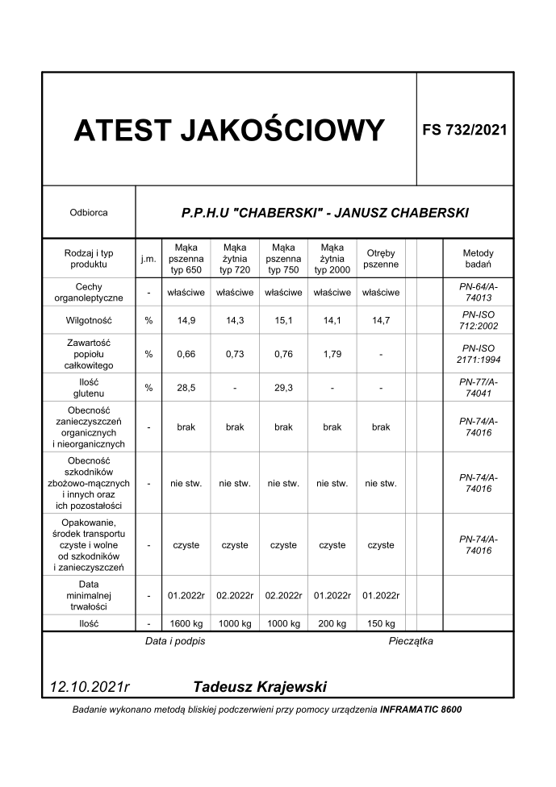
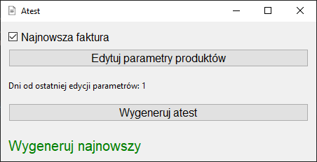
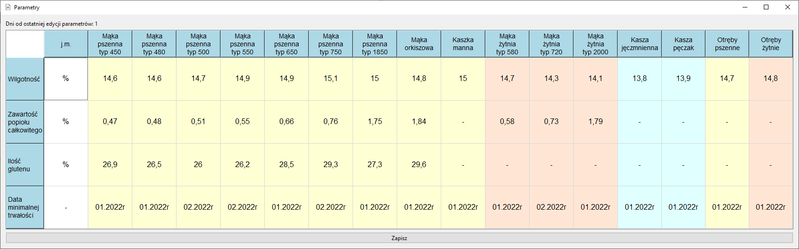

# Atest
## About project
The project consists of a script that allows fast generation of quality attestation, and QUI application that wraps it in a way, that is easy to use and to maintain. The Main objective was to make a simple program to speed up attestation document generation, generally for my dad's usage in his mill company. Considering that, the app was designed to be user straightforward to use. 

**The Script** allows for one-click PDF generation, getting all the data from the newest invoice, along with products parameters from a saved database.

**The QUI** wraps the script, allowing parameters editing and free choice in terms of which invoice will be used in attestation generation.

## Usage
The script is straightforward, if not given any parameters, it will generate attestation from the newest invoice.

    

In the QUI you can quickly do the same by just clicking "Generate" button. Additionally, you can uncheck the "Get newest" checkbox, which will allow to input ID of the invoice you want to use in generation. 

    

After clicking the "Edit parameters" button, another window will pop up. This window consists of table of different parameters like 'humidity' or 'expiry date' for every product. 

    

Data is read from database, and will be saved to it after clicking the "Save" button. This will additionally close the window and allow for further attestation generation.

The app was compiled to executable file for easier usage.